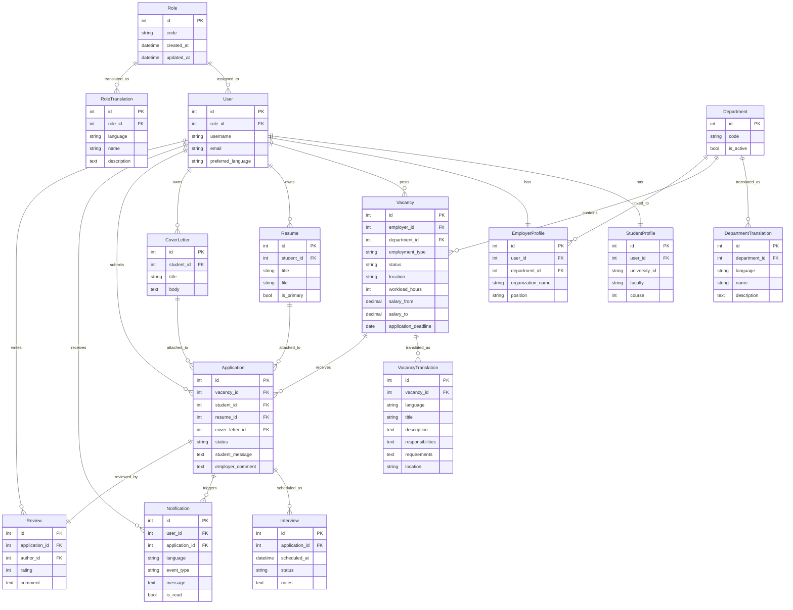

# Database Diagram (ER)

```mermaid
erDiagram
    Role ||--o{ User : "assigned_to"
    Role ||--o{ RoleTranslation : "translated_as"

    User ||--|| StudentProfile : "has"
    User ||--|| EmployerProfile : "has"

    Department ||--o{ DepartmentTranslation : "translated_as"
    Department ||--o{ Vacancy : "contains"
    Department ||--o{ EmployerProfile : "linked_to"

    User ||--o{ Vacancy : "posts"
    Vacancy ||--o{ VacancyTranslation : "translated_as"
    Vacancy ||--o{ Application : "receives"

    User ||--o{ Resume : "owns"
    User ||--o{ CoverLetter : "owns"
    User ||--o{ Application : "submits"
    User ||--o{ Notification : "receives"
    User ||--o{ Review : "writes"

    Resume ||--o{ Application : "attached_to"
    CoverLetter ||--o{ Application : "attached_to"

    Application ||--o{ Interview : "scheduled_as"
    Application ||--o{ Notification : "triggers"
    Application ||--|| Review : "reviewed_by"

    Role {
      int id PK
      string code
      datetime created_at
      datetime updated_at
    }
    RoleTranslation {
      int id PK
      int role_id FK
      string language
      string name
      text description
    }
    User {
      int id PK
      int role_id FK
      string username
      string email
      string preferred_language
    }
    StudentProfile {
      int id PK
      int user_id FK
      string university_id
      string faculty
      int course
    }
    EmployerProfile {
      int id PK
      int user_id FK
      int department_id FK
      string organization_name
      string position
    }
    Department {
      int id PK
      string code
      bool is_active
    }
    DepartmentTranslation {
      int id PK
      int department_id FK
      string language
      string name
      text description
    }
    Vacancy {
      int id PK
      int employer_id FK
      int department_id FK
      string employment_type
      string status
      string location
      int workload_hours
      decimal salary_from
      decimal salary_to
      date application_deadline
    }
    VacancyTranslation {
      int id PK
      int vacancy_id FK
      string language
      string title
      text description
      text responsibilities
      text requirements
      string location
    }
    Resume {
      int id PK
      int student_id FK
      string title
      string file
      bool is_primary
    }
    CoverLetter {
      int id PK
      int student_id FK
      string title
      text body
    }
    Application {
      int id PK
      int vacancy_id FK
      int student_id FK
      int resume_id FK
      int cover_letter_id FK
      string status
      text student_message
      text employer_comment
    }
    Interview {
      int id PK
      int application_id FK
      datetime scheduled_at
      string status
      text notes
    }
    Notification {
      int id PK
      int user_id FK
      int application_id FK
      string language
      string event_type
      text message
      bool is_read
    }
    Review {
      int id PK
      int application_id FK
      int author_id FK
      int rating
      text comment
    }
```
